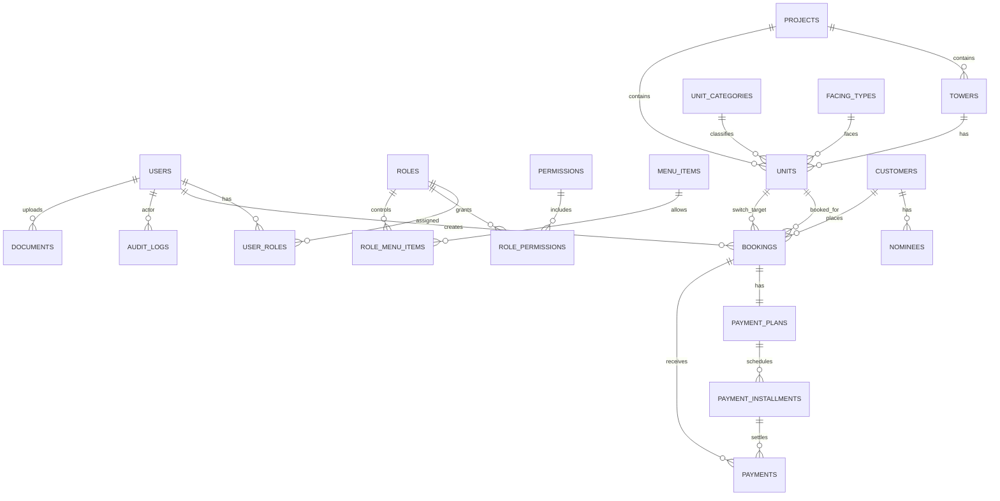

# Database Schema (Optimized)

## Design Goals
- Handle both apartments and shops cleanly
- Preserve booking workflow from legacy form
- Scale query performance with deliberate indexes
- Keep data integrity with strict relations and enums

## ER Diagram

## High-Impact Indexes
- `Unit`: `(unitKind, listingStatus)`, `(towerId, floorNo)`, `(projectId, serialNo)`, unique `(projectId, towerId, unitNo)`
- `Booking`: `(status, bookingDate)`, `(mode, bookingDate)`, `(unitId, status)`, `(customerId, bookingDate)`
- `PaymentInstallment`: `(status, dueDate)`
- `Payment`: `(bookingId, paymentDate)`, `(mode, paymentDate)`
- `Customer`: name/phone/cnic search indexes
- `AuditLog`: entity and actor timeline indexes

## Field Quality and Normalization
- Money and area values use `Decimal` instead of float
- Enums used for:
  - `BookingMode`
  - `BookingStatus`
  - `UnitKind`
  - `UnitListingStatus`
  - `PaymentMode`
- Legacy text anomalies should be normalized during import

## Booking Mode Mapping
- REGULAR
- TRANSFER
- CANCEL
- SWITCHING
- GIFT
